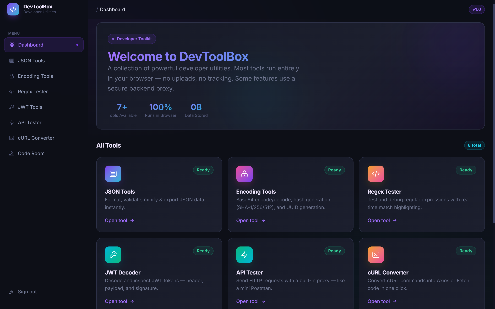
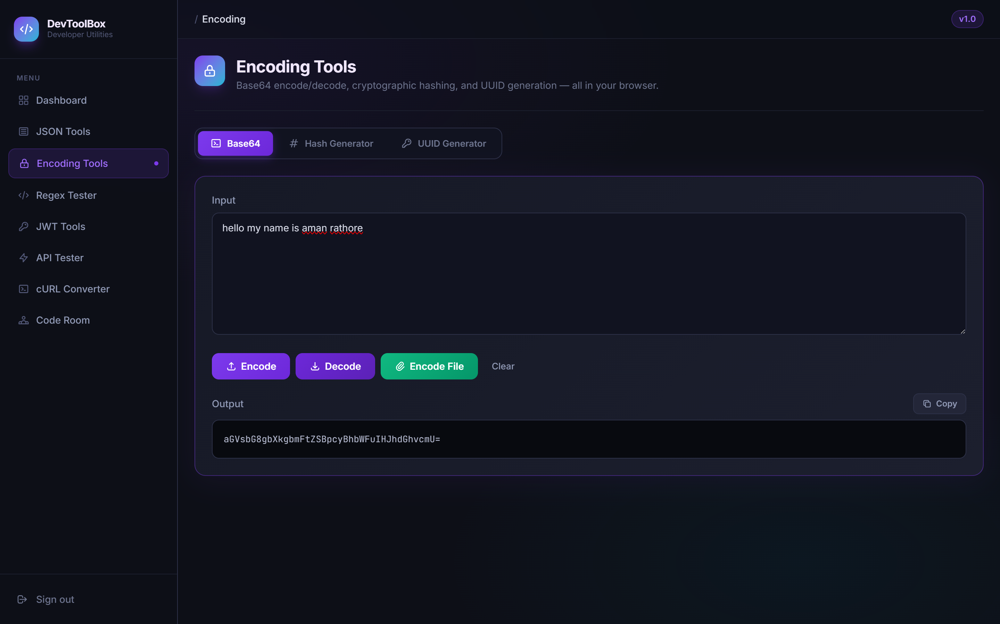
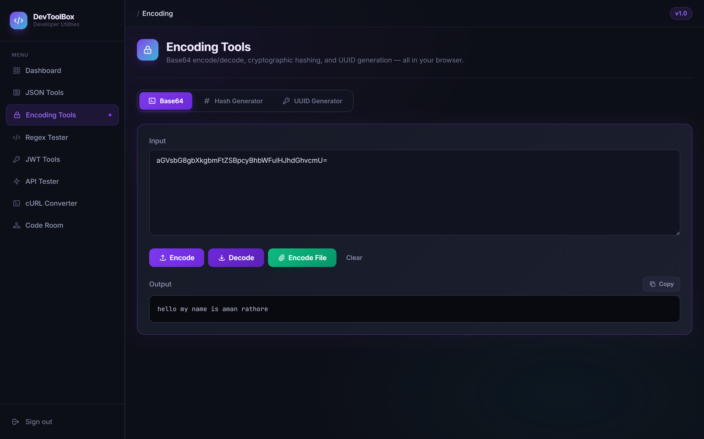
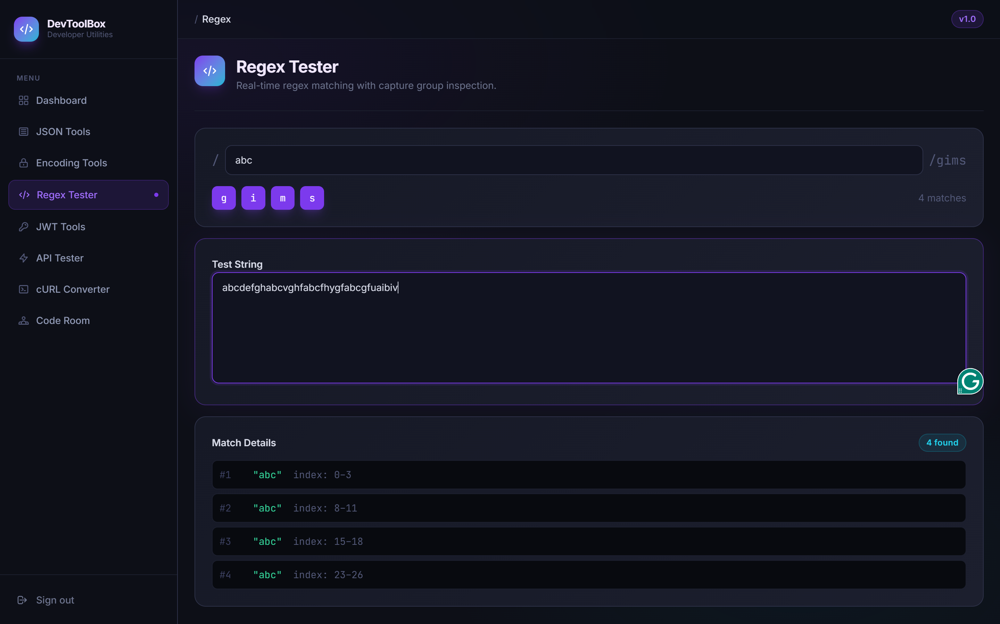
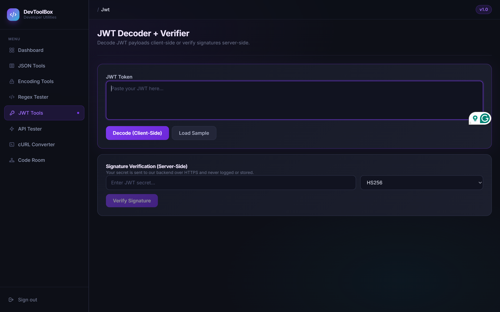
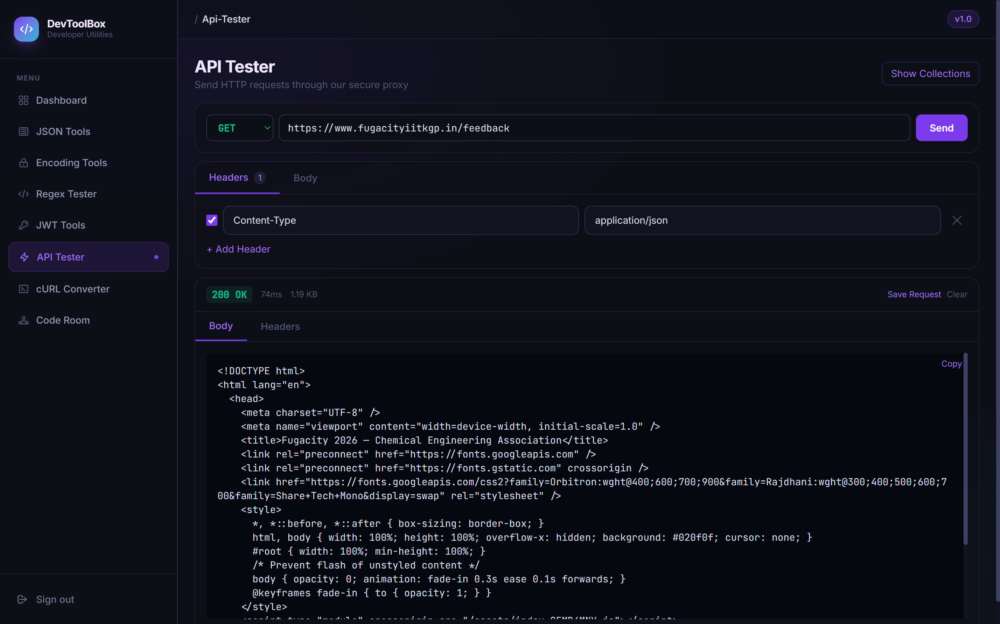
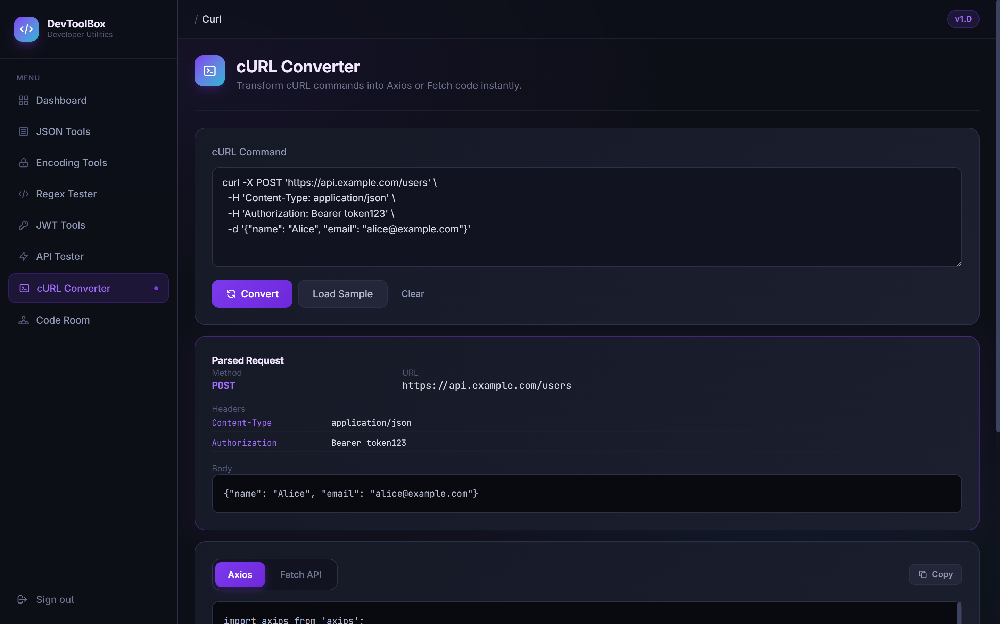
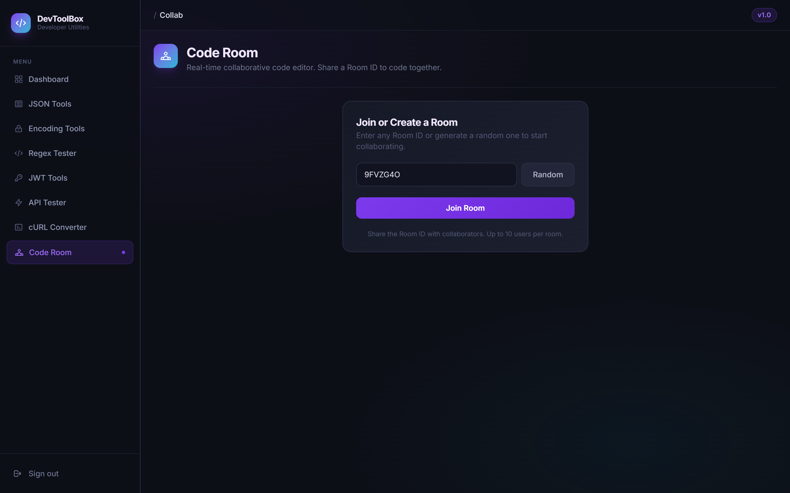
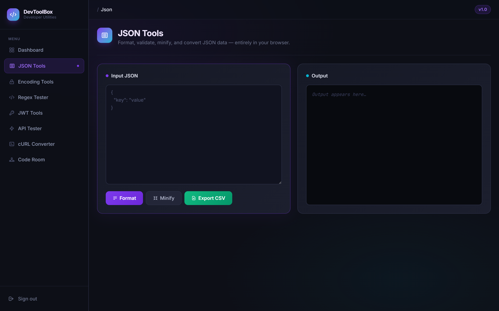

# DevToolBox
A web-based developer toolbox where developers can test APIs, decode JWTs, format JSON, and run regex — all in one place, without switching between five different websites.

---

# Deployment Links
- Frontend (Vercel): https://devtoolbox-client.vercel.app
- Backend (Render): https://devtoolbox-backend.onrender.com

# Features
##  **User Authentication**
Register/Login with JWT-based auth (access + refresh tokens), HttpOnly cookie session handling, and auto-redirect to login if the session is missing or expired

##  **Dashboard**
A single home screen listing every tool available, with quick-open cards for each one

##  **Encoding Tools**
Base64 encode/decode (including file encoding), cryptographic hash generation (SHA-1/256/512), and UUID generation — all in-browser

##  **Regex Tester**
Real-time regex matching with flag toggles (g/i/m/s) and detailed capture group / match index inspection

##  **JWT Decoder + Verifier**
Decode JWT payloads client-side instantly, or verify the signature server-side (HS256) — secrets are sent over HTTPS and never logged or stored

##  **API Tester**
Send HTTP requests (GET/POST/etc.) through a secure backend proxy with custom headers — like a mini Postman, right in the browser

##  **cURL Converter**
Paste a cURL command and instantly get equivalent Axios or Fetch API code, with parsed method/URL/headers/body breakdown

##  **Code Room**
Real-time collaborative code editor powered by Socket.io — generate or enter a Room ID and share it to code together live (up to 10 users per room)

##  **JSON Tools**
Format, minify, validate, and export JSON data to CSV — entirely client-side

##  **Security**
- SSRF guard on the API Tester proxy to block requests to internal/private network ranges
- Helmet.js for HTTP security headers
- HttpOnly + Secure + SameSite cookies for refresh tokens

##  **Fully Responsive UI**
Dark-themed, responsive layout built with Tailwind CSS for mobile, tablet, and desktop

##  **Tech Stack**
- Frontend: React.js + Vite, Redux Toolkit, Tailwind CSS, Monaco Editor, Socket.io-client
- Backend: Node.js, Express.js, MongoDB (hosted on MongoDB Atlas), Socket.io
- Deployment: Backend on Render & Frontend on Vercel
